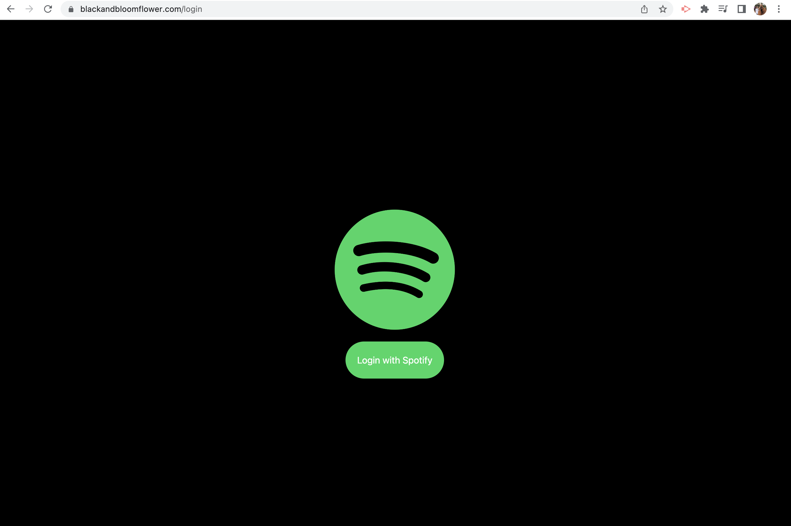
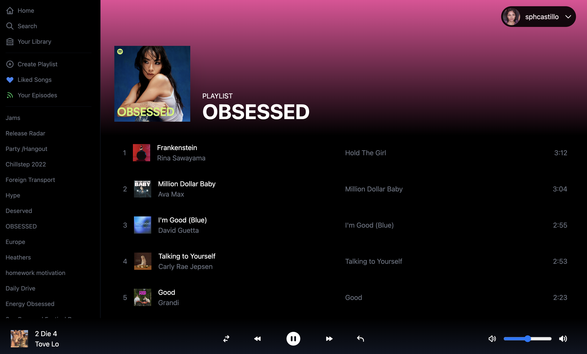

# Spotify Build - A Spotify Demo

## Description

Delivering a digital music service. 

A fully responsive Spotify clone that can fetch Spotify playlists using the Spotify API. Get into a vibe - PLAY, PAUSE, STOP - you're in contol of your playlists!

## Requirements

- You must have a Spotify premium account

- You must connect to Spotify developer
https://developer.spotify.com/

ReactJS, NextJS, TailwindCSS, @heroicons/react, @next-auth@beta, spotify-web-api-node, tailwind-scrollbar-hide, lodash, recoil

## Technologies & Methods Used

ReactJS, NextJS, TailwindCSS, SpotifyAPI, oauth JWT, access/refresh, tokens, Recoil, Debounce

oauth JWT -> used to authenticate user & persist their login state

Recoil -> state management / used to access user's Spotify playlists

Debounce -> used to prevent multiple API calls / spamming

## Github Repository

https://github.com/sphcastillo/spotify_clone

## Deployed Site

You must have Spotify open to be able to listen to music and Spotify must be open for this demo to work. 

http://sophspotifydemo.com/

## More info

Author: Sophia Castillo,

Email: Sphcastillo@gmail.com,

Professional website: www.builtbysophia.com,

GitHub: https://github.com/sphcastillo,

LinkedIn: https://www.linkedin.com/in/sophiacastillo-ca

